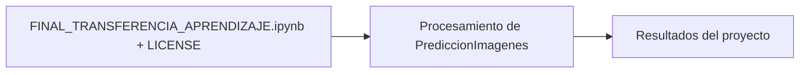

# PrediccionImagenes — Clasificación de Imágenes con Transfer Learning

## Descripción

Proyecto de aprendizaje automático que clasifica imágenes convirtiéndolas primero a su representación en píxeles y aplicando **transfer learning** (reutilización de un modelo preentrenado) para predecir a qué categoría pertenece cada imagen. El notebook está preparado para poder adaptarse a distintos conjuntos de imágenes, no solo al caso con el que fue entrenado originalmente.

## Contenido

- `FINAL_TRANSFERENCIA_APRENDIZAJE.ipynb` — notebook con el preprocesamiento de imágenes, transfer learning y predicción.
- `LICENSE` — GPL-3.0.

## Diagrama

[Explorar la arquitectura interactiva en GitDiagram](https://gitdiagram.com/HoracioLaphitz/PrediccionImagenes)



## Tecnologías

Python · TensorFlow / Keras · Transfer Learning · Jupyter Notebook

## Cómo ejecutar

```bash
pip install tensorflow numpy matplotlib jupyter
jupyter notebook FINAL_TRANSFERENCIA_APRENDIZAJE.ipynb
```

## Autor

Horacio Laphitz — [GitHub](https://github.com/HoracioLaphitz) · [LinkedIn](https://www.linkedin.com/in/horacio-laphitz)

## Licencia

GPL-3.0
